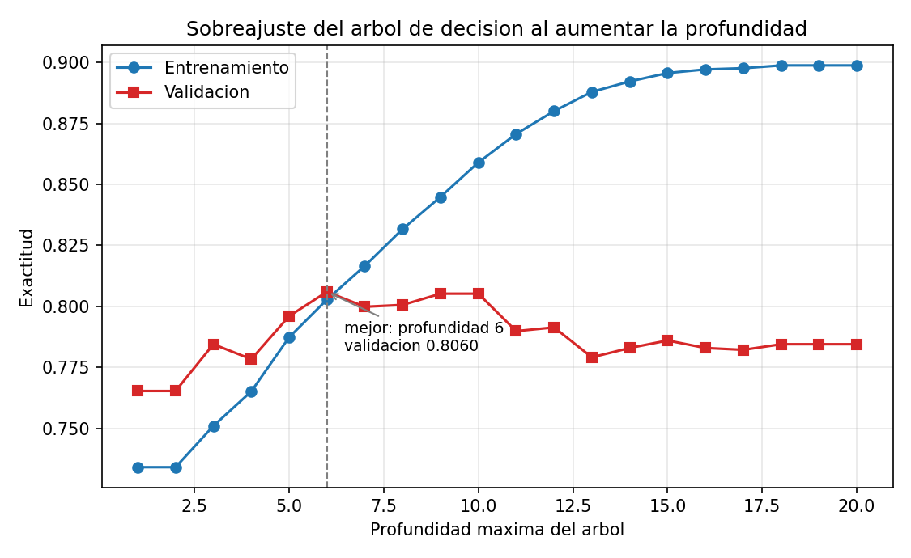
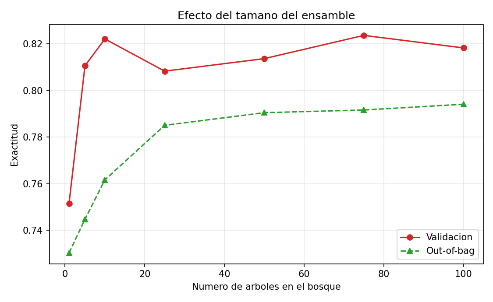
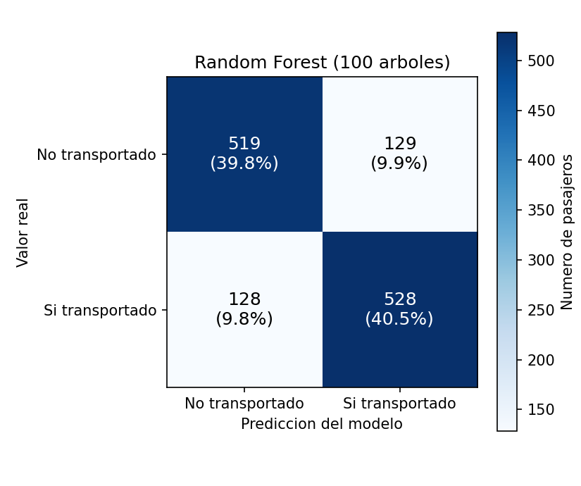
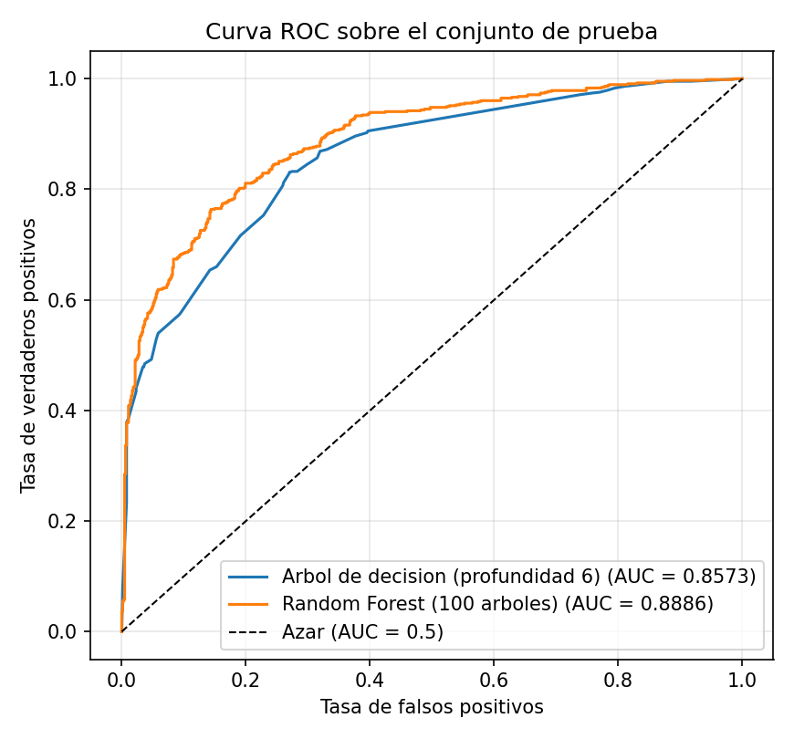
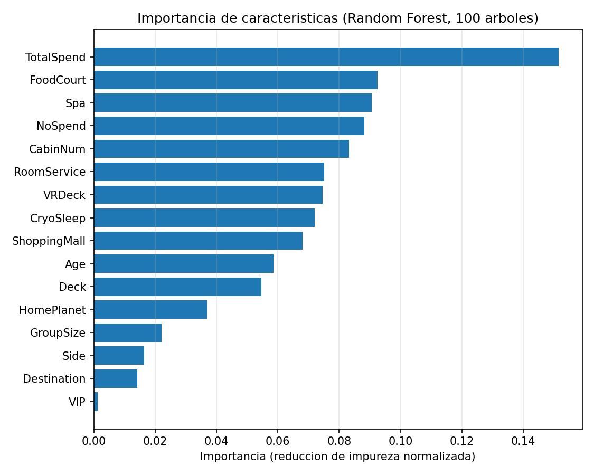

# Árbol de Decisión y Random Forest implementados sin framework

### Reporte de resultados — Momento de Retroalimentación, Módulo 2 Parte I

**Autor:** Juan Pablo Pérez — A01800483
**Indicador:** SMA0401A — Implementación de una técnica de aprendizaje máquina sin framework
**Algoritmo:** Árbol de decisión (CART) y Random Forest, programados desde cero
**Dataset:** Spaceship Titanic

---

## 1. Objetivo

Implementar manualmente un algoritmo de aprendizaje máquina, entrenarlo con un conjunto de datos
real y evaluar su capacidad de predicción. La restricción central de la actividad es que el
algoritmo no puede provenir de ninguna librería: tiene que estar programado línea por línea.

El problema elegido es de **clasificación binaria**: predecir si un pasajero de la nave espacial
Titanic fue transportado a otra dimensión después de que la nave colisionara con una anomalía
espaciotemporal.

Se implementaron dos modelos, uno construido sobre el otro:

1. Un **árbol de decisión CART**, que aprende una jerarquía de preguntas sobre las características
   del pasajero.
2. Un **Random Forest**, que combina 100 de esos árboles entrenados sobre versiones distintas de
   los datos y promedia sus respuestas.

---

## 2. El dataset

**Spaceship Titanic**, obtenido de Kaggle. Contiene 8,693 pasajeros descritos por 13
características, más la variable objetivo `Transported`.

| Característica | Tipo | Descripción |
|---|---|---|
| `HomePlanet` | Categórica | Planeta de origen: Earth, Europa o Mars |
| `CryoSleep` | Booleana | Si el pasajero viajaba en animación suspendida |
| `Cabin` | Texto | Cabina con formato `cubierta/número/lado` |
| `Destination` | Categórica | Planeta de destino |
| `Age` | Numérica | Edad del pasajero |
| `VIP` | Booleana | Si pagó servicio VIP |
| `RoomService`, `FoodCourt`, `ShoppingMall`, `Spa`, `VRDeck` | Numéricas | Gasto en cada amenidad |
| `Name` | Texto | Nombre (descartado: es un identificador sin señal predictiva) |
| **`Transported`** | **Booleana** | **Variable objetivo** |

La variable objetivo está **balanceada**: 4,378 pasajeros transportados (50.4%) contra 4,315 no
transportados (49.6%). Este balance es relevante porque significa que la exactitud (*accuracy*) es
una métrica honesta: no se puede obtener un número alto simplemente prediciendo siempre la clase
mayoritaria.

### 2.1 Qué conjunto se usó para entrenar y cuál para probar

El repositorio de Kaggle incluye un archivo `data/test.csv`, pero **ese archivo no contiene la
columna `Transported`**: es el conjunto ciego que Kaggle usa para calificar su *leaderboard*. Como
no tiene etiquetas, es imposible medir desempeño con él.

Por eso los tres conjuntos se obtuvieron **particionando `data/train.csv`** de forma estratificada,
es decir, conservando en cada parte el mismo porcentaje de cada clase que tiene el original:

| Conjunto | Muestras | % Transportados | Para qué se usó |
|---|---|---|---|
| **Entrenamiento** | 6,085 (70%) | 50.37% | Construir los árboles |
| **Validación** | 1,304 (15%) | 50.38% | Elegir la profundidad y los demás hiperparámetros |
| **Prueba** | 1,304 (15%) | 50.31% | Evaluación final, **usado una sola vez** |

La separación en tres conjuntos y no en dos es deliberada. Si la profundidad del árbol se eligiera
mirando el conjunto de prueba, ese conjunto dejaría de ser una medida imparcial: se estaría
ajustando el modelo a él indirectamente. El conjunto de validación absorbe esa función y el de
prueba se mantiene intacto hasta el final.

El archivo `data/test.csv` sí se usa, pero para lo único que sirve: demostrar predicción en lote
sobre datos nuevos sin etiqueta (sección 8.2).

---

## 3. Preprocesamiento

El dataset tiene alrededor de **2% de valores faltantes en casi todas las columnas** (entre 179 y
217 nulos por columna), así que el preprocesamiento no es opcional.

### 3.1 Imputación de valores faltantes

- Columnas **categóricas** → se rellenan con la **moda** (el valor más frecuente).
- Columnas **numéricas** → se rellenan con la **mediana**, no con la media, porque las columnas de
  gasto están fuertemente sesgadas: su mediana es 0 y su máximo supera los 29,000. La media quedaría
  arrastrada por unos pocos pasajeros de gasto extremo.

**La moda y la mediana se calculan usando solo el conjunto de entrenamiento** y después se aplican a
validación y prueba. Calcularlas sobre todos los datos sería una fuga de información: el modelo
estaría usando, indirectamente, estadísticas de las muestras contra las que se va a evaluar.

### 3.2 Ingeniería de características

De las 13 columnas originales se derivaron características nuevas, pasando de 13 a **16
características utilizables**:

| Nueva característica | Se obtiene de | Por qué |
|---|---|---|
| `Deck`, `CabinNum`, `Side` | `Cabin` (`B/0/P`) | La cabina es tres datos comprimidos en un texto. Separados, el árbol puede preguntar por cada uno |
| `GroupSize` | `PassengerId` (`gggg_pp`) | Los primeros dígitos identifican el grupo de viaje; su tamaño distingue a quien viajaba solo de quien iba en familia |
| `TotalSpend` | Suma de las 5 amenidades | Resume el consumo total en un solo número |
| `NoSpend` | `TotalSpend == 0` | Marca a quien no consumió absolutamente nada |

Las categóricas se codificaron a enteros por orden alfabético. `Name` y `PassengerId` se
descartaron como características directas.

---

## 4. Cómo funciona el algoritmo implementado

### 4.1 El árbol de decisión

Un árbol de decisión clasifica haciendo una secuencia de preguntas binarias. Cada nodo interno
contiene una pregunta de la forma `característica_j <= umbral`, y cada hoja contiene una respuesta.
El entrenamiento consiste en descubrir qué preguntas hacer y en qué orden.

**Medir la pureza de un nodo.** El criterio usado es el **índice de Gini**:

```
Gini = 1 - p₀² - p₁²
```

donde `p₀` y `p₁` son las proporciones de cada clase en el nodo. Vale **0** cuando el nodo contiene
una sola clase (pureza total) y **0.5** cuando las dos clases están al 50/50 (máxima mezcla).
También se implementó la entropía de Shannon como criterio alternativo, seleccionable con
`--criterio entropia`.

**Elegir la mejor pregunta.** Para cada característica candidata, el algoritmo evalúa *todos* los
puntos de corte posibles y se queda con el que produce la mayor reducción de impureza:

```
ganancia = Gini(padre) - [ (n_izq · Gini(izq) + n_der · Gini(der)) / n ]
```

La impureza de los hijos se pondera por su tamaño: dividir 1,000 muestras en dos grupos puros vale
más que lograr lo mismo con 10.

La implementación hace esta búsqueda de forma eficiente. En lugar de recorrer los puntos de corte
uno por uno con un ciclo, ordena los valores de la característica y usa **sumas acumuladas** para
calcular de un solo golpe la impureza de las dos mitades en todos los cortes posibles. Un corte solo
se considera válido si separa dos valores distintos y si deja suficientes muestras en cada lado.

**Construir el árbol.** El proceso se repite recursivamente en cada mitad. La recursión se detiene
cuando el nodo es puro, cuando tiene menos muestras de las permitidas, cuando se alcanza la
profundidad máxima, o cuando ninguna pregunta reduce la impureza lo suficiente. Ese conjunto de
condiciones es la **poda previa** (*pre-pruning*) y es lo que evita que el árbol memorice el
entrenamiento.

Cada hoja guarda la proporción de clases de las muestras que llegaron a ella; esa proporción es la
probabilidad que devuelve el modelo.

### 4.2 El Random Forest

Un árbol profundo tiene **varianza alta**: cambiar unas pocas muestras del entrenamiento produce un
árbol muy distinto. El Random Forest ataca ese problema entrenando muchos árboles y promediando sus
respuestas. Para que promediar sirva de algo, los árboles tienen que equivocarse de formas
*distintas*, y eso se logra con dos fuentes de azar:

**1. Bagging (bootstrap aggregating).** Cada árbol se entrena con una muestra del mismo tamaño que
el original, pero tomada **con reemplazo**. Cada muestra bootstrap contiene, en promedio, solo el
63.2% de las filas originales; algunas se repiten y otras no aparecen.

**2. Subespacio aleatorio.** En cada nodo, cada árbol solo puede elegir entre 4 características
tomadas al azar (√16 = 4). Sin esta restricción, todos los árboles pondrían la misma característica
dominante en la raíz y quedarían muy parecidos entre sí.

Al predecir, se promedian las probabilidades de los 100 árboles (**voto suave**). Como los errores
individuales son en buena medida independientes, tienden a cancelarse.

**Estimación out-of-bag.** El 36.8% de filas que quedó fuera de la bolsa de cada árbol es su
conjunto *out-of-bag*: muestras que ese árbol nunca vio. Evaluando cada fila únicamente con los
árboles que no la usaron se obtiene una estimación de generalización **gratis**, sin gastar ningún
conjunto de datos.

---

## 5. Verificación de que la implementación es correcta

Antes de reportar desempeño hay que demostrar que el algoritmo está bien programado. El archivo
`verificar.py` ejecuta **44 pruebas** que comparan la salida del código contra resultados conocidos
de antemano. Todas pasan.

| Grupo de pruebas | Qué comprueba |
|---|---|
| Medidas de impureza | Gini vale 0 en un nodo puro, 0.5 en uno 50/50 y 0.375 con p=0.25; la entropía vale 0 y 1 bit en esos mismos casos |
| Regla conocida | Con datos generados por la regla `y = 1 si x₀ > 5`, el árbol alcanza **100% de acierto**, **divide por la característica correcta**, **aprende el umbral 5.0** e ignora las tres características de ruido (99.9% de la importancia va a la característica útil). También recupera una regla con dos condiciones (AND) |
| Criterios de paro | El árbol nunca excede la profundidad pedida; con profundidad 0 queda una sola hoja; un conjunto de una sola clase no se divide; hojas más grandes producen árboles más pequeños |
| Probabilidades | Suman 1 por muestra, están entre 0 y 1, y son consistentes con el umbral de decisión |
| Métricas | Sobre una matriz de confusión construida a mano (VP=3, FN=1, FP=1, VN=3) los cinco indicadores dan exactamente 0.75; una predicción perfecta da exactitud 1 y una invertida da 0; el AUC de una separación perfecta es 1.0 y el de una puntuación constante es 0.5 |
| Random Forest | Las importancias suman 1, la estimación out-of-bag es coherente, los árboles son diversos entre sí, y el ensamble generaliza mejor que un árbol sin poda sobre datos nuevos |
| Reproducibilidad | Dos bosques con la misma semilla dan predicciones idénticas; con semillas distintas, bosques distintos |

> **Un error que estas pruebas encontraron.** La prueba "el AUC de una puntuación constante es 0.5"
> falló en la primera versión. El motivo: el cálculo del AUC no manejaba **empates** en las
> probabilidades. Esto no es un caso raro sino la situación normal de un árbol, porque todas las
> muestras que caen en la misma hoja reciben exactamente la misma probabilidad — en el conjunto de
> validación había solo **46 probabilidades distintas entre 1,304 muestras**. Sin corregirlo, el AUC
> dependía del orden en que venían las filas del archivo y quedaba inflado. La corrección fue
> colapsar cada grupo de empates en un solo punto de la curva ROC.

---

## 6. Resultados del árbol de decisión

### 6.1 El sobreajuste, medido

Se entrenó un árbol por cada profundidad de 1 a 20, comparando su acierto en entrenamiento contra
el de validación:

| Profundidad | Entrenamiento | Validación | Nodos |
|---|---|---|---|
| 1 | 0.7341 | 0.7653 | 3 |
| 3 | 0.7510 | 0.7845 | 15 |
| 5 | 0.7873 | 0.7960 | 59 |
| **6** | **0.8028** | **0.8060** | **107** |
| 8 | 0.8317 | 0.8006 | 309 |
| 10 | 0.8590 | 0.8052 | 539 |
| 13 | 0.8879 | 0.7791 | 855 |
| 16 | 0.8971 | 0.7830 | 1,001 |
| 20 | 0.8988 | 0.7845 | 1,051 |
| **sin límite** | **0.9998** | **0.7638** | **2,143** (profundidad 26) |



Esta tabla es la demostración más clara de qué es el sobreajuste. La curva de entrenamiento **sube
sin parar**, de 0.734 a 0.899, y el árbol sin límite llega a **0.9998: memoriza prácticamente todas
las 6,085 muestras de entrenamiento**. Pero la curva de validación deja de mejorar en la profundidad
6 y a partir de ahí **empeora**: el árbol sin poda cae a 0.7638, más de cuatro puntos por debajo del
árbol podado.

A partir de la profundidad 6 el árbol ya no está aprendiendo patrones del problema, está aprendiendo
particularidades de las 6,085 muestras concretas que le tocaron. Duplicar los nodos veinte veces
(de 107 a 2,143) no compra nada de capacidad predictiva; la destruye.

**Se eligió profundidad 6**, la mejor según validación.

### 6.2 Las reglas que aprendió

```
[TotalSpend <= 0.500]  n=6085, gini=0.500
   si  [HomePlanet <= 0.500]  n=2589, gini=0.344
   si     si  [CabinNum <= 549.000]  n=1311, gini=0.464
   si     no  [CryoSleep <= 0.500]  n=1278, gini=0.132
   no  [FoodCourt <= 531.000]  n=3496, gini=0.420
   no     si  [ShoppingMall <= 541.000]  n=2535, gini=0.352
   no     no  [Spa <= 1105.000]  n=961, gini=0.500
```

Las reglas son interpretables y coinciden con lo que dicen los datos:

- **La raíz pregunta si el pasajero gastó cero.** Es la división más informativa que existe en este
  dataset: de los 3,653 pasajeros que no gastaron nada, el **78.6% fue transportado**; de los 5,040
  que sí gastaron, solo el **29.9%**. La impureza baja de 0.500 a 0.344 en esa rama.
- **La segunda pregunta, dentro de los que no gastaron, es si el pasajero venía de la Tierra**
  (`HomePlanet <= 0.5` significa `Earth`, que es el código 0). También coincide: entre los pasajeros
  sin gasto, los de Europa fueron transportados en **97.1%** de los casos y los de Marte en 88.1%,
  contra apenas **63.3%** de los de la Tierra.
- **Del otro lado**, entre quienes sí gastaron, el árbol se dedica a preguntar *en qué* gastaron:
  FoodCourt, ShoppingMall y Spa separan distinto. Gastar en FoodCourt no significa lo mismo que
  gastar en Spa.

El árbol completo está en `resultados/arbol_completo.txt`.

---

## 7. Resultados del Random Forest

Configuración final: **100 árboles**, profundidad máxima 14, mínimo 2 muestras por hoja, 4
características por nodo. Entrenamiento completo en **18.6 segundos**; el bosque tiene en promedio
876 nodos por árbol.

### 7.1 Cuántos árboles hacen falta

| Árboles | Validación | Out-of-bag |
|---|---|---|
| 1 | 0.7515 | 0.7303 |
| 5 | 0.8106 | 0.7447 |
| 10 | 0.8221 | 0.7617 |
| 25 | 0.8083 | 0.7850 |
| 50 | 0.8137 | 0.7905 |
| 100 | 0.8183 | **0.7941** |



El salto grande ocurre al principio: **un solo árbol del bosque da 0.7515, y con cinco ya se llega a
0.8106**. Después la curva se aplana. Esto es exactamente lo que predice la teoría del bagging: los
primeros árboles aportan mucha diversidad y a partir de cierto punto los nuevos árboles se parecen
demasiado a los que ya están.

La curva de validación fluctúa un poco (0.808 a 0.824) porque con 1,304 muestras el error de
medición ronda el ±1.1%: esas diferencias son ruido, no señal. La curva **out-of-bag** es más
informativa porque se calcula sobre 6,085 muestras y sube de forma consistente, de 0.7303 a 0.7941.

Por esa razón no se ajustó más allá: se probaron profundidades de 10 a sin límite y hojas mínimas de
1 a 5, y todas las combinaciones cayeron entre 0.804 y 0.824 en validación. Perseguir esas
diferencias sería ajustar al ruido del conjunto de validación.

---

## 8. Evaluación final sobre el conjunto de prueba

Todo lo anterior se decidió con entrenamiento y validación. El conjunto de prueba se evaluó **una
sola vez**, aquí.

### 8.1 Matrices de confusión y métricas

Convención: la clase positiva es "el pasajero **sí** fue transportado".

#### Árbol de decisión (profundidad 6)

```
                       PREDICCION
                  No transp.   Si transp.
  REAL No transp.        480          168     <- 168 falsos positivos
       Si transp.        127          529     <- 127 falsos negativos
```

#### Random Forest (100 árboles)

```
                       PREDICCION
                  No transp.   Si transp.
  REAL No transp.        519          129     <- 129 falsos positivos
       Si transp.        128          528     <- 128 falsos negativos
```



| Métrica | Línea base | Árbol de decisión | **Random Forest** |
|---|---|---|---|
| **Exactitud** | 0.5031 | 0.7738 | **0.8029** |
| **Precisión** | — | 0.7590 | **0.8037** |
| **Sensibilidad (recall)** | — | **0.8064** | 0.8049 |
| **Especificidad** | — | 0.7407 | **0.8009** |
| **F1** | — | 0.7820 | **0.8043** |
| **AUC (ROC)** | 0.5 | 0.8573 | **0.8886** |



### Por qué estas métricas

- **Exactitud**: es interpretable aquí precisamente porque las clases están balanceadas. La línea
  base (predecir siempre la clase mayoritaria) da 0.5031, así que cualquier mejora sobre ese número
  es capacidad predictiva real.
- **Precisión y sensibilidad**: describen los dos tipos de error por separado. La exactitud sola
  puede esconder un modelo que acierta mucho en una clase y falla sistemáticamente en la otra.
- **Especificidad**: completa el cuadro con el comportamiento en la clase negativa. Es la métrica
  que revela la diferencia más grande entre los dos modelos.
- **F1**: media armónica de precisión y sensibilidad. Penaliza que una de las dos sea baja, cosa que
  un promedio simple no haría.
- **AUC**: evalúa la calidad del *ordenamiento* de probabilidades, independientemente del umbral de
  0.5. Un modelo puede tener exactitud mediocre y aun así ordenar bien los casos.

En este problema **ninguna de las dos clases es más costosa que la otra** —equivocarse al predecir
"transportado" no es peor que equivocarse al revés— así que no hay razón para mover el umbral de
0.5 ni para privilegiar precisión sobre sensibilidad.

---

## 9. Análisis

### 9.1 El ensamble mejora, y se puede ver exactamente dónde

El Random Forest supera al árbol individual por **2.9 puntos de exactitud** (0.8029 contra 0.7738) y
por **3.1 puntos de AUC**. Las matrices de confusión muestran de dónde sale esa ganancia:

| | Árbol | Bosque | Diferencia |
|---|---|---|---|
| Falsos positivos | 168 | 129 | **−39** |
| Falsos negativos | 127 | 128 | +1 |

La mejora es **casi enteramente en la clase negativa**. El árbol tiene un sesgo hacia predecir
"transportado": su especificidad es 0.7407 contra una sensibilidad de 0.8064, una brecha de casi
siete puntos. El bosque queda **equilibrado** (0.8009 y 0.8049, una brecha de medio punto).

La explicación es el mecanismo del bagging. Un solo árbol tiene que comprometerse con una división
concreta en cada nodo, y si esa división está sesgada por las particularidades del conjunto de
entrenamiento, el sesgo se propaga a todo el subárbol. Cien árboles entrenados sobre muestras
distintas se comprometen con divisiones distintas, y al promediar, los sesgos individuales se
cancelan.

### 9.2 Lo que importa: en qué gastó el pasajero

| Característica | Importancia |
|---|---|
| `TotalSpend` | 0.1516 |
| `FoodCourt` | 0.0925 |
| `Spa` | 0.0905 |
| `NoSpend` | 0.0882 |
| `CabinNum` | 0.0833 |
| `RoomService` | 0.0752 |
| `VRDeck` | 0.0747 |
| `CryoSleep` | 0.0719 |
| `ShoppingMall` | 0.0680 |
| `Age` | 0.0586 |
| `Deck` | 0.0546 |
| `HomePlanet` | 0.0369 |
| `GroupSize` | 0.0222 |
| `Side` | 0.0164 |
| `Destination` | 0.0143 |
| `VIP` | **0.0013** |



**Las características de gasto dominan.** Sumadas, `TotalSpend`, `NoSpend` y las cinco amenidades
concentran más del 65% de la importancia total. Las dos características derivadas que se
construyeron a mano, `TotalSpend` y `NoSpend`, ocupan el primer y cuarto lugar: la ingeniería de
características valió la pena.

**`CryoSleep` importa menos de lo que parecería.** Por sí sola es muy predictiva (81.8% de los
pasajeros en criosueño fueron transportados, contra 32.9% de los demás), pero queda en octavo lugar
porque **`NoSpend` ya captura casi la misma información**: un pasajero dormido no puede gastar. Al
ser redundantes, los árboles reparten el crédito entre ambas. Esta es una limitación conocida de la
importancia por reducción de impureza: reparte la importancia entre características correlacionadas
en vez de sumarla.

**`VIP` es prácticamente inútil** (0.0013). El servicio VIP no tuvo ninguna relación con quién fue
transportado.

### 9.3 Por qué el techo está alrededor del 80%

Un 20% de error residual no es falta de ajuste del modelo. El árbol sin poda demostró que el
algoritmo *puede* llegar a 99.98% sobre el entrenamiento: la capacidad está ahí. Lo que ocurre es
que **las características disponibles no contienen la información necesaria** para separar el 20%
restante. Hay pasajeros con perfiles esencialmente idénticos y desenlaces opuestos, y ninguna
cantidad de árboles resuelve eso.

---

## 10. Conclusiones

1. **La implementación es correcta.** Las 44 pruebas de `verificar.py` lo confirman contra
   resultados calculados a mano: el árbol recupera exactamente una regla conocida, con el umbral
   correcto y descartando el ruido, y todas las métricas coinciden con el cálculo manual.

2. **Los dos modelos aprenden de verdad.** Contra una línea base de 0.5031, el árbol alcanza 0.7738
   y el bosque 0.8029 sobre datos que nunca vio. Son 30 puntos de exactitud por encima del azar.

3. **El sobreajuste se midió, no se supuso.** Un árbol sin poda memoriza el 99.98% del entrenamiento
   y baja a 0.7638 en validación; con profundidad 6 y veinte veces menos nodos, sube a 0.8060. Más
   capacidad no es mejor modelo.

4. **El ensamble gana, y por la razón esperada.** El Random Forest mejora 2.9 puntos de exactitud
   eliminando 39 falsos positivos y corrigiendo el sesgo del árbol individual hacia la clase
   positiva. El promedio de muchos modelos con errores independientes es más estable que cualquiera
   de ellos.

5. **La ingeniería de características fue determinante.** Las dos columnas construidas a mano
   (`TotalSpend` y `NoSpend`) son la primera y la cuarta característica más importante, y la raíz
   del árbol pregunta por una de ellas.

### Limitaciones

- **Codificación ordinal de las categóricas.** Al asignar enteros por orden alfabético, el árbol
  solo puede partir las categorías respetando ese orden. Con `HomePlanet` funcionó por casualidad
  (`Earth` quedó separado de `Europa` y `Mars`, que es justo la división útil), pero con `Deck` (8
  cubiertas) limita las particiones posibles. Una codificación *one-hot* o divisiones por
  subconjunto lo resolverían.
- **La importancia por impureza reparte crédito entre características correlacionadas**, como se vio
  con `CryoSleep` y `NoSpend`. Una importancia por permutación daría una lectura más fiel.
- **No se explotó la estructura de grupos.** Los pasajeros que viajaban juntos tienden a compartir
  desenlace, y el modelo solo usa el tamaño del grupo, no lo que pasó con los demás miembros.
- **El bagging es paralelizable y aquí corre en serie.** Con 100 árboles y este tamaño de dataset no
  es un problema (18.6 segundos), pero no escalaría a millones de filas.

---

## Anexo: predicciones en ejecución

### A.1 Predicción individual desde consola (`python main.py --predecir`)

**Caso 1 — pasajero de Europa, en criosueño, sin gasto:**

```
  Random Forest:      SI fue transportado (probabilidad 96.9%)
  Arbol de decision:  SI fue transportado (probabilidad 99.7%)
```

**Caso 2 — pasajero de la Tierra, despierto, con gasto alto (5,450 en total):**

```
  Random Forest:      NO fue transportado (probabilidad 6.3%)
  Arbol de decision:  NO fue transportado (probabilidad 5.8%)
```

Los dos modelos coinciden y con alta confianza en ambos extremos, en la dirección que predicen los
datos.

### A.2 Predicción en lote (`python main.py --predecir-csv data/test.csv`)

Se predijeron las **4,277 filas** del conjunto ciego de Kaggle: 2,263 transportados (52.9%) y 2,014
no transportados. El resultado, con la probabilidad de cada pasajero, está en
`resultados/predicciones.csv`.

### A.3 Reproducibilidad

Todos los resultados de este reporte se reproducen con un solo comando:

```
python main.py --entrenar
```

Las semillas aleatorias están fijas (42 por defecto), así que dos ejecuciones dan resultados
idénticos. La bitácora completa de la corrida que generó estos números está en
`resultados/resultados.txt`.
